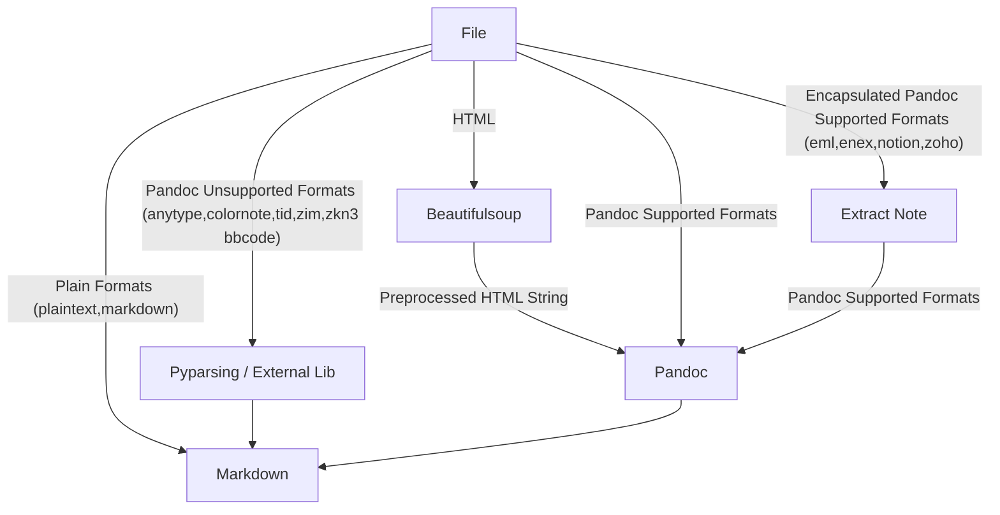

# Development Considerations

## Why Markdown?

To provide a flexible base for migrating your notes to the app of your choice.

## Why enlighten and not tqdm for progress bars?

enlighten did integrate easier with pythons logging.

## Sort all iterators with arbitrary order

Reproducibility is more important than memory usage and speed.

```python
# good
for item in sorted(file_or_folder.iterdir()):

# bad
for item in file_or_folder.iterdir():
```

## Why pyinstaller and not nuitka?

I did have a bit experience in setting up pyinstaller. The size of the final executable seems to be [much smaller with pyinstaller](https://github.com/Nuitka/Nuitka/issues/926), too.

## Why is the executable so large?

Pandoc is included and is standalone ~144 MB large. This has the biggest impact on the size. The module sizes in particular can be analyzed by using the following code snippet in the pyinstaller spec file:

```python
coll = COLLECT(
    exe,
    a.binaries,
    a.datas,
    strip=False,
    upx=True,
    upx_exclude=[],
    name='jimmy_cli',
)
```

The resulting files can be listed and ordered by size by:

```bash
$ du -lh --max-depth=2 dist/jimmy_cli | sort -h
12K     dist/jimmy_cli/_internal/src
24K     dist/jimmy_cli/_internal/wheel-0.44.0.dist-info
40K     dist/jimmy_cli/_internal/Markdown-3.7.dist-info
44K     dist/jimmy_cli/_internal/anyblock_exporter
60K     dist/jimmy_cli/_internal/cryptography-43.0.3.dist-info
60K     dist/jimmy_cli/_internal/setuptools
108K    dist/jimmy_cli/_internal/ossl-modules
164K    dist/jimmy_cli/_internal/puremagic
296K    dist/jimmy_cli/_internal/charset_normalizer
2,4M    dist/jimmy_cli/_internal/yaml
11M     dist/jimmy_cli/_internal/cryptography
15M     dist/jimmy_cli/_internal/lib-dynload
144M    dist/jimmy_cli/_internal/pypandoc
213M    dist/jimmy_cli/_internal
262M    dist/jimmy_cli
```

## Why cryptography and not pycryptodome?

They worked both at the first implementation. `cryptography` made a slightly better impression, so it was chosen.

## Format Conversion Paths



## Intermediate Format

- **HTML**:
  - Easily modifyable by beautifulsoup and others.
  - Supports wide range of elements that can be "reduced" to Markdown.
  - No additional dependency (beautifulsoup is used already).
- Pandoc AST:
  - Python: Panflute and pandocfilters aren't up-to-date (problems with tables especially).
  - Lua: Learning curve, second scripting language in this repo.
  - General: Some filters need some preprocessing (in HTML), like iframes.
