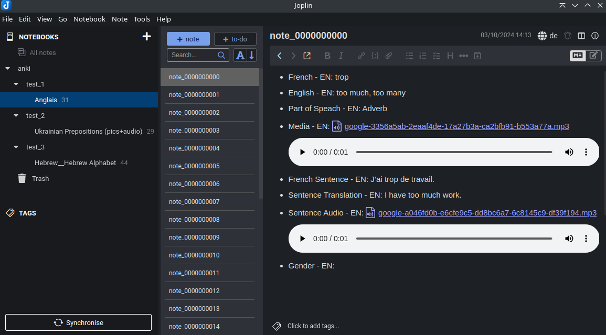

This page describes how to convert Anki cards to Markdown.

## General Information

- [Website](https://apps.ankiweb.net/)
- Typical extension: `.apkg`

## Instructions

1. Export as described [at the website](https://docs.ankiweb.net/exporting.html)
    1. Choose "Deck (.apkg)"
2. [Install jimmy](../index.md#installation)
3. Convert to Markdown. Example: `jimmy-cli-linux MEILLEUR_DECK_ANGLAIS_3000.apkg --format anki`
4. [Import to your app](../import_instructions.md)

## Import Structure

- Decks are converted to folders.
- Cards are converted to Markdown files. The content is the "answer" data.
- Referenced resources (audio, images and other files) are converted.

A converted page looks like:

## Known Limitations

- Nested decks are not tested and most likely not working.
- HTML formatting is lost. It's too complext to cover all HTML templates properly.
