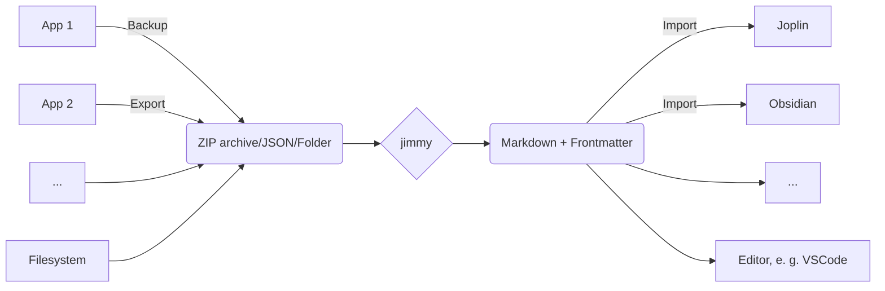

# Welcome to jimmy's documentation!

**jimmy** is a tool to import your notes from different formats to Markdown.

## Features

- ✅ Many input formats, like Google Keep, Standard Notes, Synology Note Station, Zoho Notebook and more
- ✅ Markdown + Frontmatter output
    - Compatible with any text editor
    - Can be imported to Joplin/Obsidian/...
    - Preserves resources, tags and note links when possible
- ✅ Offline
- ✅ Open Source
- ✅ Cross-platform
- ✅ Standalone (no Docker, Python or NodeJS installation required)

## Installation

**Download jimmy here: [Linux](https://github.com/marph91/jimmy/releases/latest/download/jimmy-cli-linux) | [Windows](https://github.com/marph91/jimmy/releases/latest/download/jimmy-cli-windows.exe) | [MacOS](https://github.com/marph91/jimmy/releases/latest/download/jimmy-cli-darwin)**

!!! note

    The MacOS app is untested.

Alternative installation options:

1. CLI app: `jimmy-cli-*`. Available at the [release page](https://github.com/marph91/jimmy/releases/latest).
2. Clone the repository and use it from python by `python src/jimmy_cli.py`.

## General Usage

1. Export/backup notes from your note application
2. Run `jimmy`, which converts your notes to Markdown
3. Import the result to Joplin/Obsidian or even use any editor like VSCode

For detailed instructions, see the page of the specific format.

## Quickstart

1. [Import from text files](./formats/default.md) or import from specific apps, like [Google Keep](./formats/google_keep.md)
2. Verify that everything was converted properly. The Markdown notes should be available in a new folder named like `YYYY-MM-DD HH:MM:SS - Jimmy Import`.
