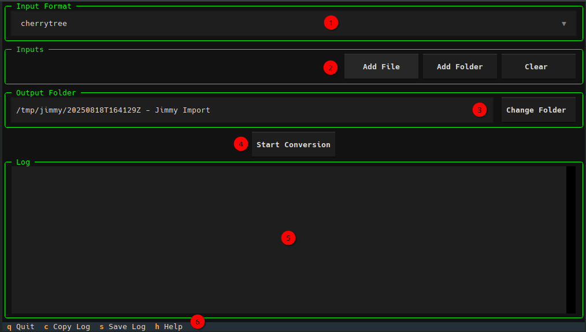
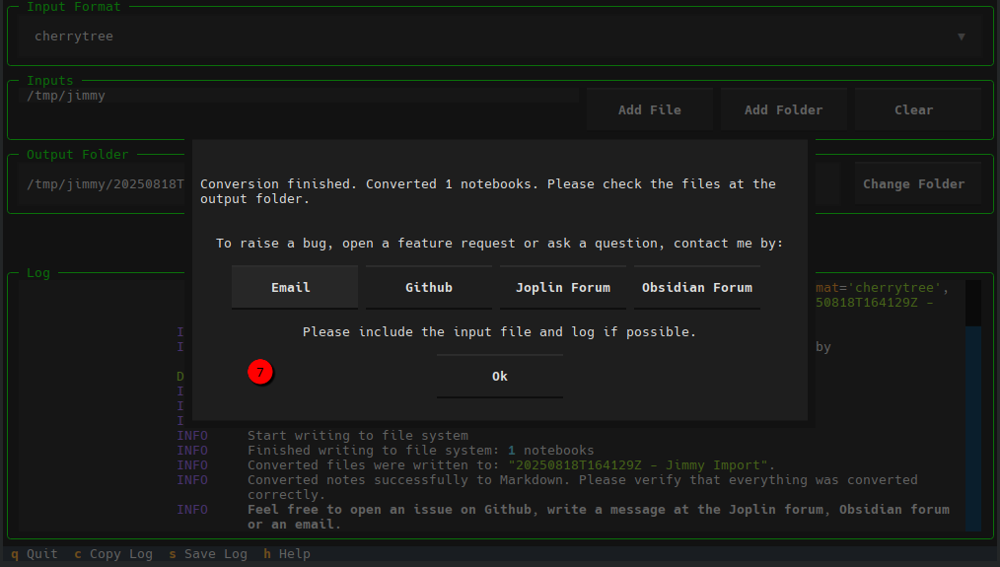

This page describes how to use Jimmy to do a conversion from your notes app to Markdown.

## Preparation

| Step | Linux / macOS Example | Windows Example |
| --- | --- | --- |
| Export your notes to your download folder | `/home/user/Downloads/Export.zip` | `C:\Users\user\Downloads\Export.zip` |
| Download Jimmy to your download folder [1] | `/home/user/Downloads/jimmy-linux` | `C:\Users\user\Downloads\jimmy-windows.exe` |
| Open a terminal | [Linux](https://www.wikihow.com/Open-a-Terminal-Window-in-Ubuntu) / [macOS](https://www.wikihow.com/Open-a-Terminal-Window-in-Mac) instructions | [Windows instructions](https://www.wikihow.com/Open-Terminal-in-Windows) |
| Change to the download folder | `cd /home/user/Downloads/` | `cd C:\Users\user\Downloads\` |
| Make Jimmy executable | `chmod +x jimmy-linux` | \-  |

Now there are two options to do the conversion. They are explained in the following sections.

## Conversion using the CLI

The CLI can be used for scripting and provides the full set of features.

| Step | Linux / macOS Example | Windows Example |
| --- | --- | --- |
| Do the conversion [2] [3] [4] | `./jimmy-linux cli Export.zip --format notion` | `jimmy-windows.exe cli Export.zip --format notion` |
| Check the output folder | `/home/user/Downloads/20250226T200101Z - Jimmy Import from notion` | `C:\Users\user\Downloads\20250226T200101Z - Jimmy Import from notion` |
| (Show the help) | `./jimmy-linux cli --help` | `jimmy-windows.exe cli --help` |

[1] On Windows: If Jimmy is flagged as virus, please [report the false positive to your antivirus vendor](https://github.com/pyinstaller/pyinstaller/blob/c7f12ccfaa2e116c3b7cfb58dadfc1e6b8c6882d/.github/ISSUE_TEMPLATE/antivirus.md#reporting-false-positives-to-av-vendors). As workaround, you can try an older version of Jimmy.

[2] On macOS: If there is the error message `zsh: bad CPU type in executable`, please use [this executable](https://github.com/marph91/jimmy/releases/latest/download/jimmy-darwin-x86_64). It is supported by Intel chips.

[3] On macOS: If there is the error message `"jimmy-darwin-arm64" cannot be opened because the developer cannot be verified`, please authorize Jimmy at `System Settings → Privacy & Security → Security → Open Anyway`. See also the [Apple support guide](https://support.apple.com/en-gb/guide/mac-help/mchlc5fb7f9c/mac).

[4] On Linux: If there is the error message ``version `GLIBC_2.35' not found``, you can either try update your OS or use an older Jimmy build. The glibc version is usually upwards compatible:

| Jimmy Version | Glibc Version |
| --- | --- |
| From [v0.1.0](https://github.com/marph91/jimmy/releases/tag/v0.1.0) | 2.35 |
| [v0.0.56](https://github.com/marph91/jimmy/releases/tag/v0.0.56) | 2.31 |

## Conversion using the TUI

The TUI can be used to do the conversion interactively. Currently there is only a limited feature subset implemented.

| Number | Step | Linux / macOS Example | Windows Example |
| ---: | --- | --- | --- |
| | Start the TUI | `./jimmy-linux tui` | `jimmy-windows.exe tui` |
| 1 | Select the input format | | |
| 2 | Choose the input files or folders | | |
| 3 | Select the output folder | | |
| 4 | Start the conversion | | |
| 5 | Observe the log | | |
| 7 | Check the dialog after the conversion finished | | |
| | Check the output folder | `/home/user/Downloads/20250226T200101Z - Jimmy Import from notion` | `C:\Users\user\Downloads\20250226T200101Z - Jimmy Import from notion` |
| 6 | (Show help, copy the log and exit the app) | | |

{: width=75%}

{: width=75%}
