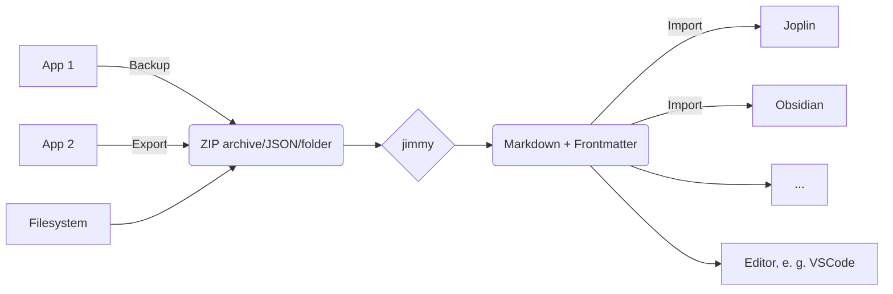

# jimmy

Free your notes by converting them to markdown.

For detailed information, take a look at the [Documentation](https://marph91.github.io/jimmy/).

If this app is useful for you, feel free to star it on [github](https://github.com/marph91/jimmy).

[](https://github.com/marph91/jimmy/actions/workflows/build.yml)
[](https://github.com/marph91/jimmy/actions/workflows/lint.yml)
[](https://github.com/marph91/jimmy/actions/workflows/tests.yml)

## Features

- ✅ Many input formats, like Google Keep, Standard Notes, Synology Note Station, Zoho Notebook and more
- ✅ Markdown + Frontmatter output
    - Compatible with any text editor
    - Can be imported to Joplin/Obsidian/...
    - Preserves resources, tags and note links when possible
- ✅ Offline
- ✅ Open Source
- ✅ Cross-platform
- ✅ Standalone (no python or node installation required)

## General usage



1. Export/backup notes from your note application
2. Run `jimmy`, which converts your notes to markdown
3. Import the result to Joplin/Obsidian or even use any editor like VSCode

For detailed instructions, see the page of the specific format.

## Quickstart

1. Download jimmy here: [**Linux**](https://github.com/marph91/jimmy/releases/latest/download/jimmy-cli-linux) | [**Windows**](https://github.com/marph91/jimmy/releases/latest/download/jimmy-cli-windows.exe) | [**MacOS**](https://github.com/marph91/jimmy/releases/latest/download/jimmy-cli-darwin) [^macos]
2. Examples for the Linux CLI app:

```bash
# import a single file supported by pandoc
jimmy-cli-linux libre_office_document.odt

# import all files in a folder
jimmy-cli-linux path/to/folder

# import a Google Keep export
jimmy-cli-linux takeout-20240401T160516Z-001.zip --format google_keep
```

After importing, the notes should be available in a new Joplin notebook named like `YYYY-MM-DD HH:MM:SS - Import`. Make sure your data is imported properly :exclamation:

What is converted (in most cases)?

- Note content
- Tags / Labels
- Resources / Attachments
- Images
- External links and internal note links

If something is not working, please check the issues first. If you can't find anything, feel free to create a new issue. It might be just not implemented yet or a regression. On the other side, the exported data can be sparse. In that case it's not possible to transfer the data with jimmy.

[^macos]: The MacOS app is untested.

## Demo

<https://github.com/marph91/jimmy/assets/33229141/de8f8e96-f925-4eef-8ff3-f69b5ee067ef>

## Similar Projects

- [Obsidian-Importer](https://github.com/obsidianmd/obsidian-importer)
- [YANOM-Note-O-Matic (fork)](https://github.com/stereohorse/YANOM-Note-O-Matic)
