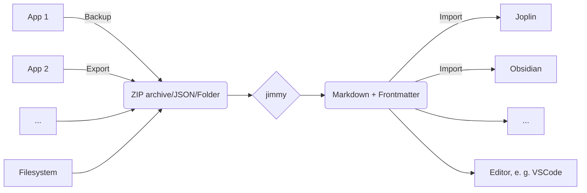

# jimmy

Free your notes by converting them to Markdown.

:floppy_disk: Download: [**Linux**](https://github.com/marph91/jimmy/releases/latest/download/jimmy-cli-linux) | [**Windows**](https://github.com/marph91/jimmy/releases/latest/download/jimmy-cli-windows.exe) | [**MacOS**](https://github.com/marph91/jimmy/releases/latest/download/jimmy-cli-darwin-arm64)  [](https://github.com/marph91/jimmy/releases/latest)

:blue_book: For detailed information, take a look at the [Documentation](https://marph91.github.io/jimmy/).

:star: If this app is useful for you, feel free to star it on [github](https://github.com/marph91/jimmy).

[](https://github.com/marph91/jimmy/actions/workflows/build.yml)
[](https://github.com/marph91/jimmy/actions/workflows/lint.yml)
[](https://github.com/marph91/jimmy/actions/workflows/tests.yml)

## Features

- ✅ Several supported input formats
- ✅ Markdown + Frontmatter output
    - Compatible with any text editor
    - Can be imported to Joplin/Obsidian/...
    - Preserves resources, tags and note links when possible
- ✅ Offline
- ✅ Open Source
- ✅ Cross-platform
- ✅ Standalone (no Docker, Python or NodeJS installation required)
- ❎ No AI

## Supported Apps

Export data from your app and convert it to Markdown. For details, click on the links.

||||||
| :--- | :---: | :---: | :---: | :---: |
| **A** | <br>[Anki](https://marph91.github.io/jimmy/formats/anki/) | <br>[Anytype](https://marph91.github.io/jimmy/formats/anytype/) |
| **B** | <br>[Bear](https://marph91.github.io/jimmy/formats/bear/) |
| **C** | <br>[Cacher](https://marph91.github.io/jimmy/formats/cacher/) | <br>[CherryTree](https://marph91.github.io/jimmy/formats/cherrytree/) | <br>[Clipto](https://marph91.github.io/jimmy/formats/clipto/) | <br>[ColorNote](https://marph91.github.io/jimmy/formats/colornote/) |
| **D** | <br>[Day&nbsp;One](https://marph91.github.io/jimmy/formats/day_one/) | <br>[Dynalist](https://marph91.github.io/jimmy/formats/dynalist/) |
| **E** | <br>[Evernote](https://marph91.github.io/jimmy/formats/evernote/) |
| **F** | <br>[Facebook](https://marph91.github.io/jimmy/formats/facebook/) | <br>[FuseBase, Nimbus&nbsp;Note](https://marph91.github.io/jimmy/formats/fusebase/) |
| **G** | <br>[Google&nbsp;Docs](https://marph91.github.io/jimmy/formats/google_docs/) | <br>[Google&nbsp;Keep](https://marph91.github.io/jimmy/formats/google_keep/) |
| **J** | <br>[Joplin](https://marph91.github.io/jimmy/formats/joplin/) | <br>[jrnl](https://marph91.github.io/jimmy/formats/jrnl/) |
| **N** | <br>[Notion](https://marph91.github.io/jimmy/formats/notion/) |
| **O** | <br>[Obsidian](https://marph91.github.io/jimmy/formats/obsidian/) |
| **Q** | <br>[QOwnNotes](https://marph91.github.io/jimmy/formats/qownnotes/) |
| **R** | <br>[RedNotebook](https://marph91.github.io/jimmy/formats/rednotebook/) |
| **S** | <br>[Simplenote](https://marph91.github.io/jimmy/formats/simplenote/) | <br>[Standard&nbsp;Notes](https://marph91.github.io/jimmy/formats/standard_notes/) | <br>[Synology Note&nbsp;Station](https://marph91.github.io/jimmy/formats/synology_note_station/) |
| **T** | [Textbundle, Textpack](https://marph91.github.io/jimmy/formats/textbundle/) | <br>[Tiddlywiki](https://marph91.github.io/jimmy/formats/tiddlywiki/) | <br>[Tomboy-ng, Gnote](https://marph91.github.io/jimmy/formats/tomboy_ng/) | <br>[Turtl](https://marph91.github.io/jimmy/formats/turtl/) |
| **W** | <br>[Wordpress](https://marph91.github.io/jimmy/formats/wordpress/) |
| **Z** | <br>[Zettelkasten](https://marph91.github.io/jimmy/formats/zettelkasten/) | <br>[Zim](https://marph91.github.io/jimmy/formats/zim/) | <br>[Zoho&nbsp;Notebook](https://marph91.github.io/jimmy/formats/zoho_notebook/) |

## Supported Formats

Import a single file or a folder (recursively). Files of these formats will be converted to Markdown. The formats can be mixed. For example you can import a folder with two Asciidoc files and one docx file. The conversion result will be a folder with three Markdown files and the corresponding attachments.

||||
| :--- | :---: | :---: |
| **A** | <br>[Asciidoc](https://marph91.github.io/jimmy/formats/default/) |
| **C** | <br>[CSV](https://marph91.github.io/jimmy/formats/default/) |
| **D** | [DocBook](https://marph91.github.io/jimmy/formats/default/) | <br>[docx](https://marph91.github.io/jimmy/formats/default/) |
| **E** | [eml](https://en.wikipedia.org/wiki/Email#Filename_extensions) | <br>[EPUB](https://marph91.github.io/jimmy/formats/default/) |
| **F** | <br>[Fountain](https://marph91.github.io/jimmy/formats/default/) |
| **H** | <br>[HTML](https://marph91.github.io/jimmy/formats/default/) |
| **J** | <br>[Jupyter Notebook](https://marph91.github.io/jimmy/formats/default/) |
| **M** | <br>[Markdown](https://marph91.github.io/jimmy/formats/default/) | <br>[MediaWiki](https://marph91.github.io/jimmy/formats/default/) |
| **O** | <br>[ODT](https://marph91.github.io/jimmy/formats/default/) | <br>[OPML](https://marph91.github.io/jimmy/formats/default/) |
| **R** | [reStructuredText](https://marph91.github.io/jimmy/formats/default/) | [RTF](https://marph91.github.io/jimmy/formats/default/) |
| **T** | [txt2tags](https://marph91.github.io/jimmy/formats/default/) |

## General Usage



1. Export/backup notes from your note application
2. Run `jimmy`, which converts your notes to Markdown
3. Import the result to Joplin/Obsidian or use any editor to view the notes

For detailed instructions, see the page of the [specific format](https://marph91.github.io/jimmy/formats/default/).

## Quickstart

1. Download jimmy here: [**Linux**](https://github.com/marph91/jimmy/releases/latest/download/jimmy-cli-linux) | [**Windows**](https://github.com/marph91/jimmy/releases/latest/download/jimmy-cli-windows.exe) | [**MacOS**](https://github.com/marph91/jimmy/releases/latest/download/jimmy-cli-darwin-arm64)
2. Examples for the Linux CLI app:

```bash
# import a single file supported by pandoc
jimmy-cli-linux libre_office_document.odt

# import all files in a folder
jimmy-cli-linux path/to/folder

# import a Google Keep export
jimmy-cli-linux takeout-20240401T160516Z-001.zip --format google_keep
```

After conversion, the notes should be available in a folder named like `YYYY-MM-DD HH:MM:SS - Import`. Make sure your data is converted properly :exclamation:

What is converted (in most cases)?

- Note content
- Tags / Labels
- Images / Resources / Attachments
- External links and internal note links

If something is not working, please check the issues first. If you can't find anything, feel free to create a new issue. It might be just not implemented yet or a regression. On the other side, the exported data can be sparse. In that case it's not possible to transfer the data with jimmy.

## Demo

This is an example of a successful conversion:

```bash
$ jimmy-cli-linux .cache/google_keep/takeout-20240401T160516Z-001.zip --format google_keep --frontmatter joplin
[09/19/24 15:15:34] INFO     Importing notes from ".cache/google_keep/takeout-20240401T160516Z-001.zip"
                    INFO     Start parsing
                    INFO     Finished parsing: 1 notebooks, 3 notes, 1 resources, 3 tags
                    INFO     Start filtering
                    INFO     Finished filtering: 1 notebooks, 3 notes, 1 resources, 3 tags
                    INFO     Start writing to file system
                    INFO     Converted notes successfully to Markdown: "20240919T131534Z - Jimmy Import from google_keep". Please verify that everything was converted correctly.
                    INFO     Feel free to open an issue on Github, write a message at the Joplin forum or an email.

Notebooks  100%|████████████████████████████████████████████████████████████████████| 1/1 [00:00<00:00]
Notes      100%|████████████████████████████████████████████████████████████████████| 3/3 [00:00<00:00]
Resources  100%|████████████████████████████████████████████████████████████████████| 1/1 [00:00<00:00]
Tags       100%|████████████████████████████████████████████████████████████████████| 3/3 [00:00<00:00]
```

## Similar Projects

- [Obsidian-Importer](https://github.com/obsidianmd/obsidian-importer)
- [YANOM-Note-O-Matic (fork)](https://github.com/stereohorse/YANOM-Note-O-Matic)
