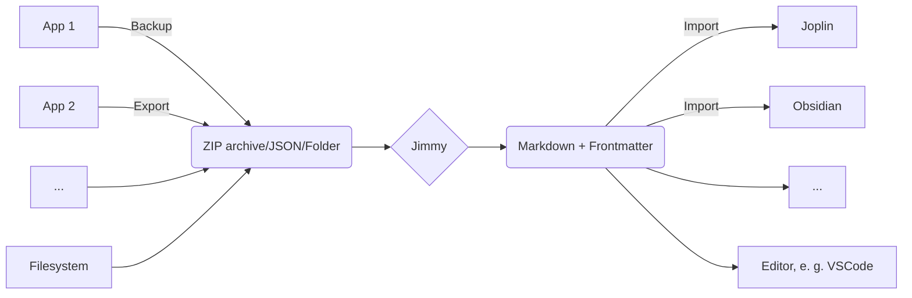

Free your notes by converting them to Markdown.

:floppy_disk: Download: [**Linux**](https://github.com/marph91/jimmy/releases/latest/download/jimmy-cli-linux) | [**Windows**](https://github.com/marph91/jimmy/releases/latest/download/jimmy-cli-windows.exe) | [**macOS**](https://github.com/marph91/jimmy/releases/latest/download/jimmy-cli-darwin-arm64) [](https://hanadigital.github.io/grev/?user=marph91&repo=jimmy)

If there is an issue at download or execution, please take a look at the [step-by-step instructions](#step-by-step-instructions).

:blue_book: For detailed information, take a look at the [Documentation](https://marph91.github.io/jimmy/).

:star: If Jimmy is useful for you, feel free to star it on [GitHub](https://github.com/marph91/jimmy).

[](https://github.com/marph91/jimmy/actions/workflows/build.yml)
[](https://github.com/marph91/jimmy/actions/workflows/lint.yml)
[](https://github.com/marph91/jimmy/actions/workflows/tests.yml)

## Use Cases

- Migrate between note apps
- Save your notes in a future-proof, human-readable format
- Prepare your notes for processing in a LLM

## Demo

Example commands for the Linux CLI app:

```bash
# convert a single file supported by pandoc
jimmy-cli-linux libre_office_document.odt

# convert all files in a folder
jimmy-cli-linux path/to/folder

# convert a Google Keep export
jimmy-cli-linux takeout-20240401T160516Z-001.zip --format google_keep
```

This is an example of a successful conversion:

https://github.com/user-attachments/assets/dcd2bc5e-2442-468e-a792-5def563c6981

## Features

- ✅ Several supported input formats
- ✅ Markdown + Front matter output
    - Compatible with any text editor
    - Can be imported to Joplin/Obsidian/...
    - Preserves resources, tags and note links when possible
- ✅ Offline
- ✅ Open Source
- ✅ Cross-platform
- ✅ Standalone (no Docker, Python or Node.js installation required)
- ❎ No AI

## Supported Apps

Export data from your app and convert it to Markdown. For details, click on the links.

`A`  [Anki](https://marph91.github.io/jimmy/formats/anki/)  [Anytype](https://marph91.github.io/jimmy/formats/anytype/)
`B`  [Bear](https://marph91.github.io/jimmy/formats/bear/)
`C`  [Cacher](https://marph91.github.io/jimmy/formats/cacher/)  [CherryTree](https://marph91.github.io/jimmy/formats/cherrytree/)  [Clipto](https://marph91.github.io/jimmy/formats/clipto/)  [ColorNote](https://marph91.github.io/jimmy/formats/colornote/)
`D`  [Day One](https://marph91.github.io/jimmy/formats/day_one/)  [Drafts](https://marph91.github.io/jimmy/formats/drafts/)  [Dynalist](https://marph91.github.io/jimmy/formats/dynalist/)
`E`  [Evernote](https://marph91.github.io/jimmy/formats/evernote/)
`F`  [Facebook](https://marph91.github.io/jimmy/formats/facebook/)  [FuseBase / Nimbus Note](https://marph91.github.io/jimmy/formats/nimbus_note/)
`G`  [Google Docs](https://marph91.github.io/jimmy/formats/google_docs/)  [Google Keep](https://marph91.github.io/jimmy/formats/google_keep/)
`J`  [Joplin](https://marph91.github.io/jimmy/formats/joplin/)  [jrnl](https://marph91.github.io/jimmy/formats/jrnl/)
`N`  [Notion](https://marph91.github.io/jimmy/formats/notion/)
`O`  [Obsidian](https://marph91.github.io/jimmy/formats/obsidian/)
`Q`  [QOwnNotes](https://marph91.github.io/jimmy/formats/qownnotes/)
`R`  [RedNotebook](https://marph91.github.io/jimmy/formats/rednotebook/)  [Roam Research](https://marph91.github.io/jimmy/formats/roam_research/)
`S`  [Simplenote](https://marph91.github.io/jimmy/formats/simplenote/)  [Standard Notes](https://marph91.github.io/jimmy/formats/standard_notes/)  [Synology Note Station](https://marph91.github.io/jimmy/formats/synology_note_station/)
`T`  [Telegram](https://marph91.github.io/jimmy/formats/tiddlywiki/) <svg xmlns="http://www.w3.org/2000/svg" viewBox="0 0 384 512" style="height:20px;max-width:20px;" fill="gray" opacity="0.5"><!--!Font Awesome Free 6.7.2 by @fontawesome - https://fontawesome.com License - https://fontawesome.com/license/free Copyright 2025 Fonticons, Inc.--><path d="M64 464c-8.8 0-16-7.2-16-16L48 64c0-8.8 7.2-16 16-16l160 0 0 80c0 17.7 14.3 32 32 32l80 0 0 288c0 8.8-7.2 16-16 16L64 464zM64 0C28.7 0 0 28.7 0 64L0 448c0 35.3 28.7 64 64 64l256 0c35.3 0 64-28.7 64-64l0-293.5c0-17-6.7-33.3-18.7-45.3L274.7 18.7C262.7 6.7 246.5 0 229.5 0L64 0zm56 256c-13.3 0-24 10.7-24 24s10.7 24 24 24l144 0c13.3 0 24-10.7 24-24s-10.7-24-24-24l-144 0zm0 96c-13.3 0-24 10.7-24 24s10.7 24 24 24l144 0c13.3 0 24-10.7 24-24s-10.7-24-24-24l-144 0z"/></svg> [Textbundle / Textpack](https://marph91.github.io/jimmy/formats/textbundle/)  [Tiddlywiki](https://marph91.github.io/jimmy/formats/tiddlywiki/)  [Tomboy-ng / Gnote](https://marph91.github.io/jimmy/formats/tomboy_ng/)  [Turtl](https://marph91.github.io/jimmy/formats/turtl/)
`W`  [Wordpress](https://marph91.github.io/jimmy/formats/wordpress/)
`Z`  [Zettelkasten](https://marph91.github.io/jimmy/formats/zettelkasten/)  [Zim](https://marph91.github.io/jimmy/formats/zim/)  [Zoho Notebook](https://marph91.github.io/jimmy/formats/zoho_notebook/)

## Supported Formats

Convert a single file or a folder (recursively). Files of these formats will be converted to Markdown. The formats can be mixed. For example, you can convert a folder with two Asciidoc files and one DOCX file. The conversion result will be a folder with three Markdown files and the corresponding attachments.

`A`  [Asciidoc](https://marph91.github.io/jimmy/formats/default/)
`C`  [CSV](https://marph91.github.io/jimmy/formats/default/)
`D` <svg xmlns="http://www.w3.org/2000/svg" viewBox="0 0 384 512" style="height:20px;max-width:20px;" fill="gray" opacity="0.5"><!--!Font Awesome Free 6.7.2 by @fontawesome - https://fontawesome.com License - https://fontawesome.com/license/free Copyright 2025 Fonticons, Inc.--><path d="M64 464c-8.8 0-16-7.2-16-16L48 64c0-8.8 7.2-16 16-16l160 0 0 80c0 17.7 14.3 32 32 32l80 0 0 288c0 8.8-7.2 16-16 16L64 464zM64 0C28.7 0 0 28.7 0 64L0 448c0 35.3 28.7 64 64 64l256 0c35.3 0 64-28.7 64-64l0-293.5c0-17-6.7-33.3-18.7-45.3L274.7 18.7C262.7 6.7 246.5 0 229.5 0L64 0zm56 256c-13.3 0-24 10.7-24 24s10.7 24 24 24l144 0c13.3 0 24-10.7 24-24s-10.7-24-24-24l-144 0zm0 96c-13.3 0-24 10.7-24 24s10.7 24 24 24l144 0c13.3 0 24-10.7 24-24s-10.7-24-24-24l-144 0z"/></svg> [DocBook](https://marph91.github.io/jimmy/formats/default/)  [DOCX](https://marph91.github.io/jimmy/formats/default/)
`E` <svg xmlns="http://www.w3.org/2000/svg" viewBox="0 0 384 512" style="height:20px;max-width:20px;" fill="gray" opacity="0.5"><!--!Font Awesome Free 6.7.2 by @fontawesome - https://fontawesome.com License - https://fontawesome.com/license/free Copyright 2025 Fonticons, Inc.--><path d="M64 464c-8.8 0-16-7.2-16-16L48 64c0-8.8 7.2-16 16-16l160 0 0 80c0 17.7 14.3 32 32 32l80 0 0 288c0 8.8-7.2 16-16 16L64 464zM64 0C28.7 0 0 28.7 0 64L0 448c0 35.3 28.7 64 64 64l256 0c35.3 0 64-28.7 64-64l0-293.5c0-17-6.7-33.3-18.7-45.3L274.7 18.7C262.7 6.7 246.5 0 229.5 0L64 0zm56 256c-13.3 0-24 10.7-24 24s10.7 24 24 24l144 0c13.3 0 24-10.7 24-24s-10.7-24-24-24l-144 0zm0 96c-13.3 0-24 10.7-24 24s10.7 24 24 24l144 0c13.3 0 24-10.7 24-24s-10.7-24-24-24l-144 0z"/></svg> [EML](https://en.wikipedia.org/wiki/Email#Filename_extensions)  [EPUB](https://marph91.github.io/jimmy/formats/default/)
`F`  [Fountain](https://marph91.github.io/jimmy/formats/default/)
`H`  [HTML](https://marph91.github.io/jimmy/formats/default/)
`J`  [Jupyter Notebook](https://marph91.github.io/jimmy/formats/default/)
`M`  [Markdown](https://marph91.github.io/jimmy/formats/default/)  [MediaWiki](https://marph91.github.io/jimmy/formats/default/)
`O`  [ODT](https://marph91.github.io/jimmy/formats/default/)  [OPML](https://marph91.github.io/jimmy/formats/default/)
`R` <svg xmlns="http://www.w3.org/2000/svg" viewBox="0 0 384 512" style="height:20px;max-width:20px;" fill="gray" opacity="0.5"><!--!Font Awesome Free 6.7.2 by @fontawesome - https://fontawesome.com License - https://fontawesome.com/license/free Copyright 2025 Fonticons, Inc.--><path d="M64 464c-8.8 0-16-7.2-16-16L48 64c0-8.8 7.2-16 16-16l160 0 0 80c0 17.7 14.3 32 32 32l80 0 0 288c0 8.8-7.2 16-16 16L64 464zM64 0C28.7 0 0 28.7 0 64L0 448c0 35.3 28.7 64 64 64l256 0c35.3 0 64-28.7 64-64l0-293.5c0-17-6.7-33.3-18.7-45.3L274.7 18.7C262.7 6.7 246.5 0 229.5 0L64 0zm56 256c-13.3 0-24 10.7-24 24s10.7 24 24 24l144 0c13.3 0 24-10.7 24-24s-10.7-24-24-24l-144 0zm0 96c-13.3 0-24 10.7-24 24s10.7 24 24 24l144 0c13.3 0 24-10.7 24-24s-10.7-24-24-24l-144 0z"/></svg> [reStructuredText](https://marph91.github.io/jimmy/formats/default/) <svg xmlns="http://www.w3.org/2000/svg" viewBox="0 0 384 512" style="height:20px;max-width:20px;" fill="gray" opacity="0.5"><!--!Font Awesome Free 6.7.2 by @fontawesome - https://fontawesome.com License - https://fontawesome.com/license/free Copyright 2025 Fonticons, Inc.--><path d="M64 464c-8.8 0-16-7.2-16-16L48 64c0-8.8 7.2-16 16-16l160 0 0 80c0 17.7 14.3 32 32 32l80 0 0 288c0 8.8-7.2 16-16 16L64 464zM64 0C28.7 0 0 28.7 0 64L0 448c0 35.3 28.7 64 64 64l256 0c35.3 0 64-28.7 64-64l0-293.5c0-17-6.7-33.3-18.7-45.3L274.7 18.7C262.7 6.7 246.5 0 229.5 0L64 0zm56 256c-13.3 0-24 10.7-24 24s10.7 24 24 24l144 0c13.3 0 24-10.7 24-24s-10.7-24-24-24l-144 0zm0 96c-13.3 0-24 10.7-24 24s10.7 24 24 24l144 0c13.3 0 24-10.7 24-24s-10.7-24-24-24l-144 0z"/></svg> [RTF](https://marph91.github.io/jimmy/formats/default/)
`T` <svg xmlns="http://www.w3.org/2000/svg" viewBox="0 0 384 512" style="height:20px;max-width:20px;" fill="gray" opacity="0.5"><!--!Font Awesome Free 6.7.2 by @fontawesome - https://fontawesome.com License - https://fontawesome.com/license/free Copyright 2025 Fonticons, Inc.--><path d="M64 464c-8.8 0-16-7.2-16-16L48 64c0-8.8 7.2-16 16-16l160 0 0 80c0 17.7 14.3 32 32 32l80 0 0 288c0 8.8-7.2 16-16 16L64 464zM64 0C28.7 0 0 28.7 0 64L0 448c0 35.3 28.7 64 64 64l256 0c35.3 0 64-28.7 64-64l0-293.5c0-17-6.7-33.3-18.7-45.3L274.7 18.7C262.7 6.7 246.5 0 229.5 0L64 0zm56 256c-13.3 0-24 10.7-24 24s10.7 24 24 24l144 0c13.3 0 24-10.7 24-24s-10.7-24-24-24l-144 0zm0 96c-13.3 0-24 10.7-24 24s10.7 24 24 24l144 0c13.3 0 24-10.7 24-24s-10.7-24-24-24l-144 0z"/></svg> [txt2tags](https://marph91.github.io/jimmy/formats/default/)

## General Usage



1. Export/backup notes from your note application
2. Run `jimmy`, which converts your notes to Markdown
3. Import the result to Joplin/Obsidian or use any editor to view the notes

After conversion, the notes should be available in a folder named like `YYYY-MM-DD HH:MM:SS - Import`. Make sure your data is converted properly :exclamation:

What is converted (in most cases)?

- Note content
- Tags / Labels
- Images / Resources / Attachments
- External links and internal note links

## Step-by-step Instructions

| Step | Linux / macOS Example | Windows Example |
| --- | --- | --- |
| Export your notes to your download folder | `/home/user/Downloads/Export.zip` | `C:\Users\user\Downloads\Export.zip` |
| Download Jimmy to your download folder [1] | `/home/user/Downloads/jimmy-cli-linux` | `C:\Users\user\Downloads\jimmy-cli-windows.exe` |
| Open a terminal | [Linux](https://www.wikihow.com/Open-a-Terminal-Window-in-Ubuntu) / [macOS](https://www.wikihow.com/Open-a-Terminal-Window-in-Mac) instructions | [Windows instructions](https://www.wikihow.com/Open-Terminal-in-Windows) |
| Change to the download folder | `cd /home/user/Downloads/` | `cd C:\Users\user\Downloads\` |
| Make Jimmy executable | `chmod +x jimmy-cli-linux` | \-  |
| Do the conversion [2] [3] [4] | `./jimmy-cli-linux Export.zip --format notion` | `jimmy-cli-windows.exe Export.zip --format notion` |
| Check the output folder | `/home/user/Downloads/20250226T200101Z - Jimmy Import from notion` | `C:\Users\user\Downloads\20250226T200101Z - Jimmy Import from notion` |

[1] On Windows: If Jimmy is flagged as virus, please [report the false positive to your antivirus vendor](https://github.com/pyinstaller/pyinstaller/blob/c7f12ccfaa2e116c3b7cfb58dadfc1e6b8c6882d/.github/ISSUE_TEMPLATE/antivirus.md#reporting-false-positives-to-av-vendors). As workaround, you can try an older version of Jimmy.

[2] On macOS: If there is the error message `zsh: bad CPU type in executable`, please use [this executable](https://github.com/marph91/jimmy/releases/latest/download/jimmy-cli-darwin-x86_64). It is supported by Intel chips.

[3] On macOS: If there is the error message `"jimmy-cli-darwin-arm64" cannot be opened because the developer cannot be verified`, please authorize Jimmy at `System Settings → Privacy & Security → Security → Open Anyway`. See also the [Apple support guide](https://support.apple.com/en-gb/guide/mac-help/mchlc5fb7f9c/mac).

[4] On Linux: If there is the error message ``version `GLIBC_2.35' not found``, you can either try update your OS or use an older Jimmy build. The glibc version is usually upwards compatible:

| Jimmy Version | Glibc Version |
| --- | --- |
| From [v1.0.0](https://github.com/marph91/jimmy/releases/tag/v0.1.0) | 2.35 |
| [v0.0.56](https://github.com/marph91/jimmy/releases/tag/v0.0.56) | 2.31 |

## Similar Projects

- [Notesnook Importer](https://github.com/streetwriters/notesnook-importer)
- [Obsidian-Importer](https://github.com/obsidianmd/obsidian-importer)
- [YANOM-Note-O-Matic (fork)](https://github.com/stereohorse/YANOM-Note-O-Matic)
- [MarkItDown](https://github.com/microsoft/markitdown)
